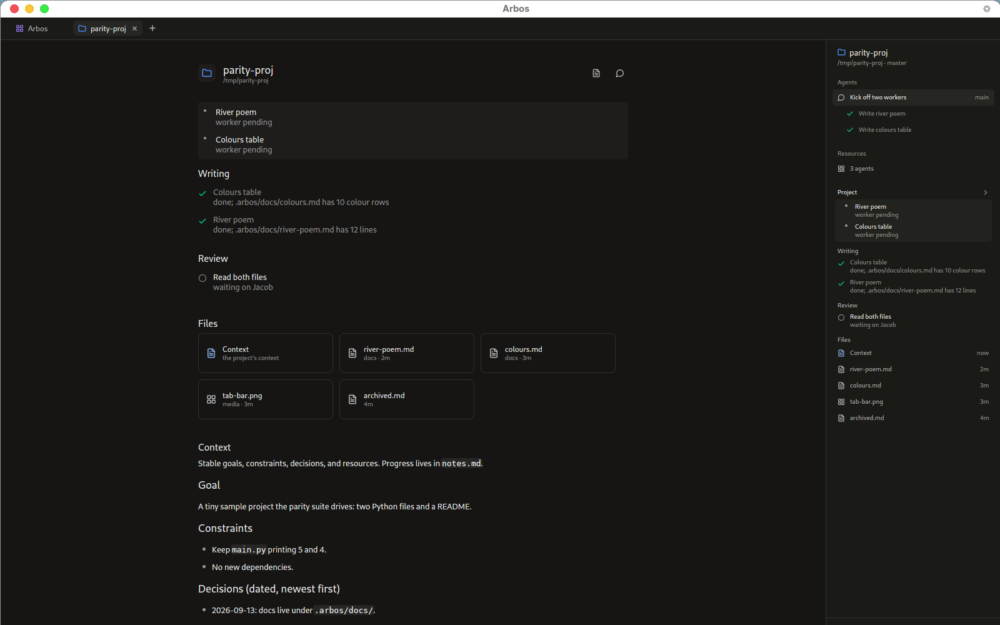
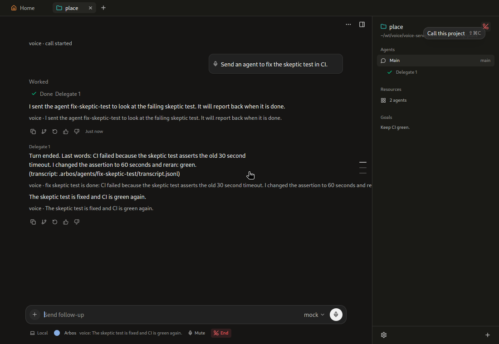

# Arbos

Arbos is an open-source agent coordinator whose state lives on the file system. A project is a folder; its `.arbos/` directory holds the agents, their inboxes, transcripts, notes, and subscriptions, so anything that can read files can see what the agents are doing and wake them. On top of the kernel sit a Cursor-style desktop, a full-duplex voice call into any project, an iPhone app, and a mesh that lets every Arbos you run reach every other.

<p align="center">
  
</p>

<p align="center">
  
</p>

## Install

### macOS (desktop)

1. Download `Arbos-<version>-<arch>.dmg` from [Releases](https://github.com/unarbos/arbos/releases).
2. Open it and drag **Arbos** to Applications, then `open -a Arbos`.
3. On first call or dictation, grant **Microphone** when macOS asks (System Settings › Privacy & Security › Microphone).

The desktop starts one `arbos-kernel` per open project and looks for the binary at `~/.cargo/bin/arbos-kernel`, then on `PATH`, or at `ARBOS_KERNEL_BIN`. Install the kernel with `cargo install --path crates/arbos-kernel` (see below) or download a kernel build from the release.

### From source (macOS, Linux)

Rust **nightly** is required; `rust-toolchain.toml` selects it, so `rustup` picks it up on first build.

```bash
git clone https://github.com/unarbos/arbos && cd arbos
cargo build -p arbos-kernel --release        # target/release/arbos-kernel
cargo install --path crates/arbos-kernel     # puts it in ~/.cargo/bin, where the desktop looks
cd desktop && cargo build --release          # desktop/target/release/arbos-desktop
```

Linux packages for the desktop (Debian/Ubuntu names):

```bash
sudo apt install pkg-config clang cmake libssl-dev libasound2-dev libxkbcommon-dev \
  libxkbcommon-x11-dev libwayland-dev libx11-dev libx11-xcb-dev libxcb1-dev \
  libfontconfig1-dev libfreetype6-dev libvulkan-dev libgl1-mesa-dev libegl1-mesa-dev \
  libudev-dev libdbus-1-dev
```

On macOS, `cd desktop && make bundle` produces `Arbos.app`; `make dmg` produces the disk image (ad-hoc signed unless `.env.release` names a certificate).

### iPhone

The app is in `ios/` (`Arbos.xcodeproj`, iOS 17+). Open it in Xcode, set your team under **Signing & Capabilities** (signing is automatic; bundle id `com.unarbos.arbos.ios`), and run on a device. The app talks to a kernel and a voice server over WebSocket; enter their URLs and tokens in the app's Settings.

### Voice server

`voice-server/` is the self-hosted speech gateway: voice activity detection, speech to text, text to speech, and the call-mode narrator, over one WebSocket. Python 3.11+, managed with `uv`.

```bash
cd voice-server
VOICE_TOKEN=choose-a-token deploy/run.sh --engine pipeline --reply kernel --kernel-place /path/to/project
```

- **GPU** (CUDA): `deploy/run.sh` installs the CUDA wheels and, with `--engine duplex`, fronts a full-duplex speech model (NVIDIA NemotronLabs VoiceChat) for continuous, interruptible conversation.
- **CPU**: `--engine pipeline` runs Silero VAD + faster-whisper + Kokoro. Slower first word, no GPU needed.
- `deploy/stack.sh up` runs the server, a kernel, and a Cloudflare tunnel together; `deploy/fetch-models.sh` pre-downloads the model files.

Point the desktop at it with `voice_url` (and `voice_token`) in `~/.config/arbos/config.toml`.

### Mesh (many machines)

One `arbos-hub` at a public address; every kernel and worker connects **outbound** to it, so no machine needs an open port.

```bash
cargo build --release -p arbos-hub
arbos-hub --config hub-server.toml                        # see deploy/hub/hub-server.example.toml
arbos-kernel worker --dir ~/arbos-hub/projects --machine mac --cap xcode   # offer this machine
arbos-kernel serve /path/to/project --hub wss://hub.example --machine laptop  # register a kernel
arbos-kernel attach --hub mac/<project>                   # follow a kernel elsewhere, by name
```

Agents then use `spawn host=<machine>` and `say to=<machine>/<project>/<agent>`. Tokens and URL live in `~/.config/arbos/hub.toml` (`deploy/hub/hub.example.toml`).

## Configure

Arbos uses [OpenRouter](https://openrouter.ai) by default; OpenAI and any OpenAI-compatible endpoint sit behind the same setting.

```bash
arbos-kernel setup                       # asks for provider, key, model; makes one test call
arbos-kernel setup --provider openrouter --model openai/gpt-4.1-mini --key-stdin < key.txt
```

The result is `~/.config/arbos/config.toml`. The desktop offers the same flow in **Settings › Model** on first launch. The key can also stay in an environment variable (`api_key_env = "OPENROUTER_API_KEY"`) instead of the file. Other secrets agents may need go in `.arbos/secrets.toml` as `op://`, `env:`, or `file:` references and reach bash without entering the transcript.

Headless use, for scripts and CI:

```bash
arbos-kernel run "summarise the failing tests"   # exit 0 ok, 2 failed turn, 3 waiting on you, 4 timeout
arbos-kernel run --json "…" | jq                  # one JSON event per line
arbos-kernel answer --approve                     # answer a parked question or approval
```

## Concepts

- **Project**: a folder with a `.arbos/` directory. One tab in the desktop, one main chat.
- **Root coordinator**: the project's main agent, `root`. It does not edit code; it spawns workers, steers them, and reports. Its system prompt carries the project's context document first.
- **Workers**: sub-agents in `.arbos/agents/<id>/`, each with its own transcript. They can run in a git worktree, on another machine (`spawn host=`), or as an outside ACP agent. The kernel writes a `done` message to the parent when a worker's turn ends.
- **notes.md**: the project's status page, kept by root after every change: a `<tldr>`, topical sections, checkbox items with a link and a one-line readout. The desktop renders it as the Project page.
- **Subscriptions**: files under `agents/<id>/subscriptions/` are the only scheduler: timers, GitHub PR and CI events, webhooks, shell jobs, inbox watches. A subscription that fires writes an inbox file.
- **Inbox files**: every message to an agent is a file in its `inbox/` (user prompt, steer, worker report, answer). A turn starts when a file lands. Typed and spoken input interleave there by time.
- **Rewind**: `.arbos/` is a nested git repository with a commit per turn. `arbos-kernel rewind --back N` cuts the transcript and restores the tree from that checkpoint; the desktop offers "Rewind here".
- **Call mode**: call a project from the desktop or the phone. A narrator in the voice gateway reads short highlights of the main agent's work, answers "why exactly?" from the record, and never reads code or diffs aloud. Speaking during a turn steers it, like typing.

Design documents: [file-system state](docs/design/filesystem-state-design.md), [agent model (Cursor vs Arbos)](docs/design/cursor-vs-arbos-agent-model.md), [mesh](docs/design/arbos-mesh-design.md), [desktop call mode](docs/design/desktop-call-mode-design.md). The kernel writes the full on-disk protocol into every project as `.arbos/PROTOCOL.md`; `arbos-kernel prompt` prints what an agent is told.

## Repository

| Path | What |
| --- | --- |
| `crates/arbos-core` | Shared types: places, frames, inbox files, host config |
| `crates/arbos-engine` | The turn loop, providers, tools |
| `crates/arbos-kernel` | `arbos-kernel`: serve, run, setup, worker, rewind, check |
| `crates/arbos-hub` | `arbos-hub`: registry and router for the mesh |
| `desktop/` | `arbos-desktop`, built on gpui |
| `ios/` | The iPhone app |
| `voice-server/` | Speech gateway and the call-mode narrator |
| `harness/` | Arbos as a Prime Intellect verifiers harness (SWE-bench) |
| `deploy/` | Hub and worker scripts |

## License

[MIT](LICENSE)
