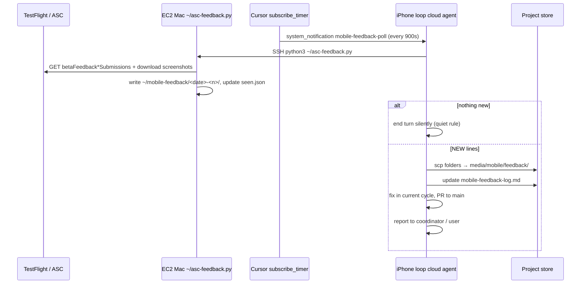

---
cursor:
  subagentId: "bc-5bb7b302-6c60-54fb-953c-3baecb3832be"
---

# TestFlight feedback loop — investigation for desktop feedback design

Read-only audit of the existing iPhone/TestFlight feedback pipeline (2026-09-16). Goal: reuse its polling/pickup pattern for desktop in-app feedback.

---

## 1. The TestFlight feedback poller

### Where the code lives

| Location | Role |
| --- | --- |
| **`~/asc-feedback.py`** on the loop's **EC2 Mac** (`ec2-user@3.89.43.68`, tag `arbos-mobile`) | The poller script (~106 lines Python). **Not in `unarbos/arbos` git.** Created 2026-09-16 by the iPhone loop cloud agent `bc-08d8261b-fea2-5075-9949-d45f6f9d4acc`. |
| **`/cursor/stores/.../internal/mobile-mac-host-and-testflight.md`** | Documents Mac host, ASC key id, CI secrets names. |
| **`/cursor/stores/.../internal/mobile-feedback-log.md`** | Human ledger: what Jacob said, what was fixed, which build carries the fix. |

There is **no crontab**, **no kernel `subscribe kind=timer`**, and **no systemd timer** for feedback. Scheduling is entirely a **Cursor Cloud Agent timer subscription** (see §3).

### How it is scheduled

The iPhone loop agent (`bc-08d8261b`) registered a recurring MCP timer:

- **Tool:** `cursor-subscriptions` → `subscribe_timer`
- **Name:** `mobile-feedback-poll` (dedupes by name; re-subscribe with same name keeps existing config)
- **Interval:** `delaySeconds: 900` (15 minutes)
- **Subscription id (example):** `sub_f446ff16-6507-443f-8f56-269e3569a1e8`
- **Expires:** ~7 days after creation (must be re-subscribed if the agent outlives expiry)

A **separate** timer drives the 90-minute dev cycle:

- **Name:** `mobile-loop-next-cycle`
- **Interval:** `delaySeconds: 5400`

When the feedback timer fires, Cursor delivers a `<system_notification source="timer" name="mobile-feedback-poll">` follow-up to the cloud agent's conversation. That opens a turn with a fixed prompt instructing the agent to SSH to the Mac and run the script.

### API called (not `--plain`)

Uses the **App Store Connect REST API** with a **JWT bearer token** (PyJWT + ES256). There is no `altool`, no `xcrun`, no `--plain` flag.

Endpoints (must go through the **app** resource — bare collection URLs return 403):

```
GET https://api.appstoreconnect.apple.com/v1/apps/6812503407/betaFeedbackScreenshotSubmissions
GET https://api.appstoreconnect.apple.com/v1/apps/6812503407/betaFeedbackCrashSubmissions
```

Query params: `include=build,tester`, `sort=-createdDate`, `limit=50`.

Screenshot image bytes are fetched separately from signed `tf-feedback.itunes.apple.com` URLs in the submission attributes.

### Credentials (names only — never print values)

| Surface | Credential / file |
| --- | --- |
| **Mac poller** | App Store Connect key **`ZV82D3ZWRT`** ("Arbos IOS", Admin) → `~/.appstoreconnect/private_keys/AuthKey_ZV82D3ZWRT.p8` |
| **Mac poller** | Issuer UUID → `~/.asc-issuer` (one line) |
| **Mac poller** | Optional override → env var **`ASC_KEY_ID`** |
| **Mac poller** | 1Password service account for other secrets → `~/.op-env` (sourced before SSH runs) |
| **GitHub CI upload** | **`IOS_ASC_KEY_P8`**, **`IOS_ASC_KEY_ID`**, **`IOS_ASC_ISSUER_ID`**, **`IOS_SECRETS_PLIST`** (set by `.github/setup-publishing.sh`) |

App Store Connect app id **`6812503407`**, bundle **`com.unarbos.arbos.ios`**, team **`25SCF3Q2AK`**.

### What it writes

**On the Mac (staging + dedupe):**

| Path | Contents |
| --- | --- |
| `~/mobile-feedback/<YYYY-MM-DD>-<n>/` | One folder per *new* submission (date from ASC `createdDate`, `n` incremented while folder exists) |
| `~/mobile-feedback/<date>-<n>/screenshot-1.jpg` (or `.png`) | Downloaded from Apple's signed URL |
| `~/mobile-feedback/<date>-<n>/feedback.json` | Structured record: ASC `id`, `kind`, `build`, `comment`, device/os, `files[]`, full `raw` attributes |
| `~/mobile-feedback/<date>-<n>/feedback.md` | Human-readable summary; tester shown as `(redacted)` in md |
| **`~/mobile-feedback/seen.json`** | **Dedupe state:** JSON array of sorted ASC submission **ids** already processed |
| `~/asc-feedback.py` | Copy of the script (also originally staged at `/tmp/mobile/asc-feedback.py` on the agent VM) |

**In the Project store (after agent copies via scp):**

| Path | Contents |
| --- | --- |
| `media/mobile/feedback/<YYYY-MM-DD>-<n>/` | Same three files; **`email` stripped** from `feedback.json` (and `raw.email`) on copy |
| `internal/mobile-feedback-log.md` | Ledger table F1…Fn: folder, build reported, Jacob's words, diagnosis, fix, **"reaches him in"** build/PR |

Stdout from the script: `NEW <folder> [kind] build … :: '<comment>'` per new item, or **`nothing new`**.

---

## 2. Feedback report folder convention and files

### Naming

```
media/mobile/feedback/<ISO-date>-<sequential-n>/
```

Examples: `2026-09-16-1`, `2026-09-16-22`, `2026-09-15-2`. The sequential `n` resets per calendar day (derived from ASC `createdDate`, not arrival order globally).

### Files per report

| File | Purpose |
| --- | --- |
| `screenshot-N.jpg` | One or more screenshots from TestFlight feedback |
| `feedback.md` | Title, build, device, iOS version, "## What Jacob wrote", file list |
| `feedback.json` | Machine-readable: `id`, `kind` (`screenshot` \| `crash`), `created`, `build`, `comment`, `device`, `os`, `files`, `raw` (full ASC attributes minus email after scrub) |

### Dedupe / ledger

1. **Primary dedupe:** `~/mobile-feedback/seen.json` on the Mac — set of ASC submission ids. Script skips ids in this set; adds new ids after writing folders. Flag **`--all`** ignores seen (re-list everything).
2. **Secondary ledger:** `internal/mobile-feedback-log.md` — one row per processed report (F-number), links folder → fix → target build. Not used for machine dedupe; human/agent traceability.
3. **No separate JSONL** or kernel inbox file for mobile feedback.

---

## 3. How an agent gets woken up

**Mechanism:** Cursor **`subscribe_timer`** MCP (`cursor-subscriptions` namespace), **not** Arbos kernel subscriptions, **not** cron, **not** GitHub/Slack subscriptions.

Flow:



**Quiet rule (coordinator, 2026-09-16 12:14 UTC):** if output is `nothing new`, the agent ends the turn **without any message** — not even "no new feedback."

**When feedback arrives:** the same timer turn also triggers triage, screenshot reading, ledger update, and a fix PR prioritized **ahead of the coverage rotation** (`mobile-coverage.md` rotation rule).

The **90-minute** `mobile-loop-next-cycle` timer is independent; it drives simulator cycles, stills, and coverage — not feedback pickup.

---

## 4. How the loop closes back to Jacob

Jacob does **not** get a direct reply inside TestFlight feedback. Closure is:

1. **Fix merged to `main`** touching `ios/**` → **`.github/workflows/ios-testflight.yml`** runs automatically → uploads to TestFlight.
2. **Build number** = `git rev-list --count HEAD` (e.g. build **994** = merge **#306**). Shown in app Settings ("0.2.0 (994)").
3. **`internal/mobile-feedback-log.md`** column **"reaches him in"** records the target build number and PR (e.g. `**994** (#306)`).
4. **Project coordinator** updates **`notes.md`** (e.g. "build 994 on his TestFlight carries the fixes…") and sends Jacob **plain-language summaries** in chat when batches of fixes land.
5. Jacob installs the new build from **TestFlight** on his phone; internal tester, builds arrive automatically.
6. For items already fixed in an earlier build, log says **"956 — open until Jacob confirms"** (explicit re-check ask, not automatic notification).

There is **no** automated push notification to Jacob about fix availability today (APNs for kernel notify is separate, gated on Jacob's APNs key).

---

## 5. `asc-feedback.py` — full script (from agent transcript)

Script is **not in git**; reproduced from the iPhone loop agent's write on 2026-09-16. Final version uses app-scoped API paths (fix for 403 on bare collection).

```python
#!/usr/bin/env python3
"""TestFlight beta feedback from App Store Connect — screenshots with their
text, and crashes — for the iPhone loop. Runs on the Mac (key in
~/.appstoreconnect/private_keys, issuer in ~/.asc-issuer); writes each new
submission to ~/mobile-feedback/<date>-<n>/ (image files + feedback.json +
feedback.md) and prints a summary line per new item. Never prints the key
or the token. State: ~/mobile-feedback/seen.json.

    asc-feedback.py [--all]   # --all: re-list everything, ignore seen
"""
import json, os, sys, time, datetime, pathlib, urllib.request, urllib.parse, urllib.error

APP_ID = "6812503407"
KEY_ID = os.environ.get("ASC_KEY_ID", "ZV82D3ZWRT")
HOME = pathlib.Path.home()
OUT = HOME / "mobile-feedback"
OUT.mkdir(exist_ok=True)
SEEN = OUT / "seen.json"

def token():
    import jwt  # PyJWT + cryptography
    key = (HOME / ".appstoreconnect/private_keys" / f"AuthKey_{KEY_ID}.p8").read_text()
    iss = (HOME / ".asc-issuer").read_text().strip()
    now = int(time.time())
    return jwt.encode({"iss": iss, "iat": now, "exp": now + 900, "aud": "appstoreconnect-v1"}, key, algorithm="ES256", headers={"kid": KEY_ID})

def get(path, params=None, tok=None):
    url = "https://api.appstoreconnect.apple.com" + path
    if params:
        url += "?" + urllib.parse.urlencode(params)
    req = urllib.request.Request(url, headers={"Authorization": f"Bearer {tok}"})
    try:
        with urllib.request.urlopen(req, timeout=30) as r:
            return r.status, json.load(r)
    except urllib.error.HTTPError as e:
        body = e.read().decode("utf-8", "replace")
        try:
            body = json.loads(body)
        except Exception:
            pass
        return e.code, body

def main():
    everything = "--all" in sys.argv
    seen = set(json.loads(SEEN.read_text())) if SEEN.exists() and not everything else set()
    tok = token()
    new = []
    for kind, path in [("screenshot", f"/v1/apps/{APP_ID}/betaFeedbackScreenshotSubmissions"), ("crash", f"/v1/apps/{APP_ID}/betaFeedbackCrashSubmissions")]:
        status, body = get(path, {"include": "build,tester", "sort": "-createdDate", "limit": "50"}, tok)
        if status != 200:
            print(f"{kind}: HTTP {status}: {json.dumps(body)[:600]}")
            continue
        included = {(i["type"], i["id"]): i for i in body.get("included", [])}
        items = body.get("data", [])
        print(f"{kind}: {len(items)} submission(s) on the account")
        for item in items:
            if item["id"] in seen:
                continue
            # ... builds folder, downloads screenshots, writes feedback.json/md ...
            seen.add(item["id"])
            new.append(...)
    SEEN.write_text(json.dumps(sorted(seen)))
    for ... in new:
        print(f"NEW {folder} [{kind}] build {build_no} ...")
    if not new:
        print("nothing new")

if __name__ == "__main__":
    main()
```

(Elided middle: folder allocation, screenshot download, record assembly — identical to agent-created version.)

---

## 6. Summaries of requested Project store files

### `internal/mobile-feedback-log.md`

Running ledger of **18+ reports (F1–F18+)**. Columns: folder name, **build Jacob was on**, his exact words, root-cause diagnosis, fix description, **"reaches him in"** (TestFlight build # and PR). Documents rules: 15-minute pickup, feedback **outranks coverage rotation**, decisions for Jacob listed not guessed. Source line documents API, script path, timer name.

### `internal/mobile-mac-host-and-testflight.md`

EC2 Mac host (`arbos-mobile`, M2, ~$0.88/h), tooling (Xcode 27, idb, ffmpeg, local hub for tests), script inventory including **`~/asc-feedback.py`**. TestFlight pipeline: app id, bundle, ASC key name, CI secret names, **`ios-testflight.yml`** on every `ios/**` merge to main. Jacob = internal tester.

### `internal/mobile-findings.md`

iPhone loop **findings ledger M-01…M-92**: id, date, source, area, what, state. Early rows reconstructed after store loss; M-80+ complete. Cross-links feedback items (F5→M-81, F18→M-90, etc.) and PRs. Tracks open kernel/hub/gateway asks.

### `internal/mobile-coverage.md`

**Coverage rotation** table: which app aspects were last exercised, in which cycle, how (simulator vs Jacob's phone), open items. Rule: every aspect within four cycles; feedback bursts can defer style-pair checks. References TestFlight build numbers for Jacob-facing checks.

### `internal/mobile-journey-runs.md`

End-to-end **journey runner** (`~/mac-journey.sh`): steps J1–J13 scored PASS/FAIL against kernel transcript (not just UI). Three runs recorded; named bugs JB-1 (root report dropped), JB-2 (photo bytes lost on ArbosLife), JB-3 (call not project-scoped). Runs write `~/mobile-out/journey/<run>/`, copies to `media/mobile/journey/<run>/`.

### `internal/features-inbox/` (2026-09-16 files)

| File | Summary |
| --- | --- |
| `2026-09-16-mobile-dictation-routed-to-kernel-and-tool-output.md` | Gateway bug: dictation finals become turns on gateway's kernel (F18); kernel ask for tool `output` on transcript (F14). |
| `2026-09-16-mobile-journey-photo-and-call-asks.md` | JB-2: photo bytes lost on `arboslife/demo`; JB-3: call not project-scoped; ArbosLife kernels stale (no notify/put). |
| `2026-09-16-mobile-spoken-turn-channel-on-transcript.md` | Kernel ask: echo `channel`/`device` on transcript `user` events for "Spoken" label. |
| `2026-09-16-apns-push-kernel-hub-answer.md` | #301 push half: phone registers token on attach; Jacob needs APNs key + capability in hub config. |
| `2026-09-16-kernel-self-update-execv-drops-the-lock-retry.md` | Self-update: use execv not spawn+exit; no 30s lock retry needed. |
| `2026-09-16-kernel-self-update-restart-semantics-answers.md` | Answers on restart semantics, hello git_sha/built_at, idle gate. |
| `2026-09-16-keyless-first-line-kernel-half.md` | #312: keyless first user line kept, not swallowed. |
| `2026-09-16-symmetry-kernel-asks-refiled.md` | Desktop parity kernel asks re-filed after store loss (F-56, F-66, etc.). |

---

## 7. Implications for desktop in-app feedback

Related work already started:

- **`internal/desktop-feedback-inventory.md`** (on `store-docs` branch): kernel log, transcript, version plumbing for a bundle.
- **`internal/features-inbox/2026-09-16-feedback-bundle-kernel-half.md`**: kernel `feedback` / `feedback_bundle` frame on PR #328 — turn trajectory + log, redacted.

The **mobile pattern to reuse:**

| Piece | Mobile (TestFlight) | Desktop (proposed analog) |
| --- | --- | --- |
| Pickup | ASC API poller on Mac | Hub endpoint or local drop folder polled by timer |
| Schedule | `subscribe_timer` 900s | Same MCP timer pattern |
| Dedupe | `seen.json` by ASC id | `seen.json` by report uuid |
| Staging | `~/mobile-feedback/<date>-<n>/` | e.g. `media/desktop/feedback/<date>-<n>/` |
| Ledger | `internal/mobile-feedback-log.md` | `internal/desktop-feedback-log.md` |
| Wake | Timer → cloud agent turn | Same |
| Close loop | TestFlight auto-upload + build # in log | Dev channel / update bar + build # in log |

The mobile loop does **not** use Arbos kernel subscriptions for feedback; it uses **Cursor's** subscription MCP on the **cloud agent** that owns the loop.
